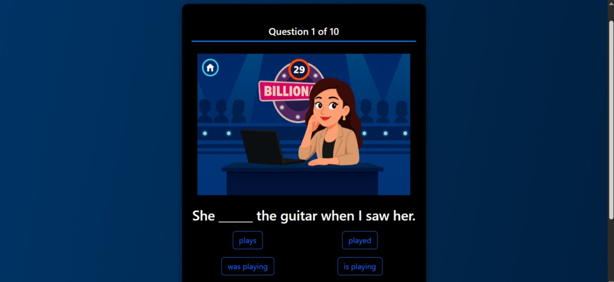

🧠 English Quiz Game - Billionaire Style

📌 Descripción

Este proyecto es un juego de cuestionario en inglés inspirado en el estilo de “¿Quién quiere ser millonario?”.
El objetivo es responder correctamente preguntas de opción múltiple en inglés y avanzar hasta la meta final.

Está desarrollado con:

-Frontend: HTML, CSS, JavaScript

-Backend: PHP

-Base de datos: MySQL

🎮 Características

Interfaz interactiva y atractiva.

Preguntas dinámicas almacenadas en una base de datos MySQL.

Sistema de puntuación progresivo.

Validación de respuestas y retroalimentación inmediata.

Fácil de personalizar (puedes agregar más preguntas desde la base de datos).

🛠️ Tecnologías usadas

* HTML5 → Estructura del juego.

* CSS3 → Estilos y diseño responsivo.

* JavaScript (ES6) → Lógica en el frontend e interacciones.

* PHP 8+ → Gestión del backend.

* MySQL → Almacenamiento de preguntas y usuarios.

⚙️ Instalación y configuración

Clonar este repositorio:

git clone https://github.com/tuusuario/english-quiz-game.git

Copiar los archivos al directorio de tu servidor local (ejemplo: htdocs en XAMPP o www en Laragon).

Importar la base de datos desde el archivo:

database/quiz.sql

Configurar la conexión en el archivo:

src/database/database.php

con tus credenciales MySQL.

Iniciar tu servidor local (Apache + MySQL).

Acceder al juego desde:

https://english-game.kesug.com
http://localhost/english-quiz-game

🚀 Uso

Ingresa tu nombre en la pantalla de inicio.

Responde las preguntas de opción múltiple.

Intenta llegar a la meta y conviértete en un Billionaire del inglés.

📂 Estructura del proyecto

📦 english-quiz-game

 ┣ 📂 src
 ┃ ┣ 📂 app
 ┃ ┃ ┣ dashboard.php
 ┃ ┃ ┗ rutas.php
 ┃ ┣ 📂 database
 ┃ ┃ ┣ consultas/
 ┃ ┃ ┗ database.php
 ┃ ┣ 📂 static
 ┃ ┃ ┣ css/
 ┃ ┃ ┗ js/
 ┃ ┗ 📂 templates
 ┃     ┗ index.html
 ┣ 📜 app.php
 ┣ 📜 README.md
 ┗ 📜 quiz.sql

🤝 Contribución

Si deseas contribuir:

Haz un fork del repositorio.

Crea una nueva rama (git checkout -b feature-nueva).

Realiza tus cambios y haz commit.

Haz push a la rama (git push origin feature-nueva).

Abre un Pull Request.

📄 Licencia

Este proyecto está bajo la licencia MIT.
